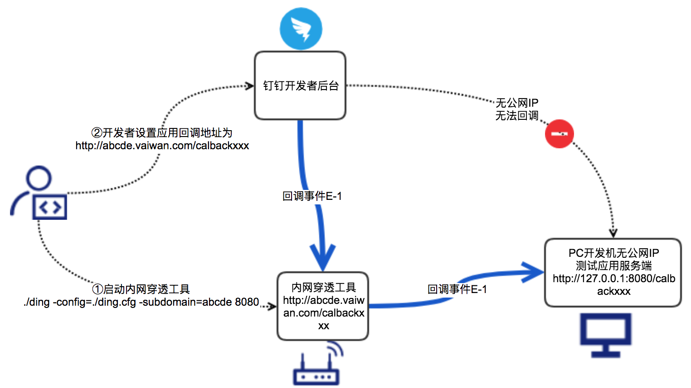
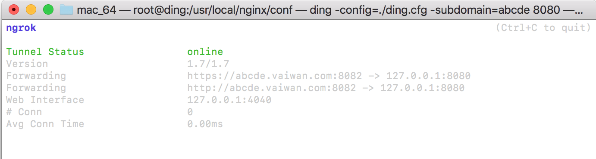
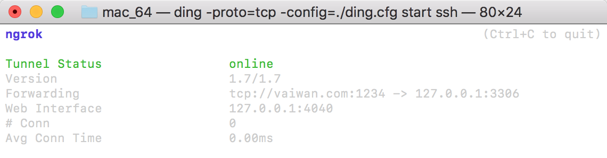

# 钉钉提供的内网穿透工具

因安全合规要求，该工具已经下线，推荐采用最新推出的 Stream 模式 5分钟快速接入：

[点击链接，加入Stream模式共创群交流](https://open-dingtalk.github.io/developerpedia/docs/explore/support/?via=moon-group)

本仓库及以下说明来自钉钉官方开发文档。

> 注意：鉴于很多开发者在临时体验开发时往往没有公网域名或者公网IP，本工具提供了一个公网代理服务，目的是方便开发测试。
> 
> 本工具当前不保证多个开发者随意设置相同的子域名导致的冲突以及通道稳定性，因此正式应用、正式环境必须是真实的公网IP或者域名，正式应用上线绝对不能使用本工具。

## 内网穿透示意图



## 使用方法

### HTTP 穿透

1. 下载工具

    ```
    git clone https://github.com/open-dingtalk/pierced.git
    ```

2. 执行命令 `./ding -config=./ding.cfg -subdomain=域名前缀 端口`。

    以 Mac 为例：

    ```
    cd mac_64
    chmod 777 ./ding
    ./ding -config=./ding.cfg -subdomain=abcde 8080
    ```

    Windows：

    ```
    cd windows_64
    ./ding -config ding.cfg -subdomain abcde 8080
    ```

    启动后界面如下图所示：

    

    命令参数说明：

    | 参数      | 说明                                                                                                                              |
    |-----------|-----------------------------------------------------------------------------------------------------------------------------------|
    | config    | 内网穿透的配置文件，按命令照示例固定为钉钉提供的./ding.cfg，无需修改。                                                            |
    | subdomain | 您需要使用的域名前缀，该前缀将会匹配到“vaiwan.com”前面，例如你的 subdomain 是 abcde，启动工具后会将 abcde.vaiwan.com 映射到本地。 |
    | 端口      | 您需要代理的本地服务 http-server 端口，例如你本地端口为 8080 等。                                                                 |

3. 启动完客户端后，你访问 http://abcde.vaiwan.com/xxxxx 都会映射到 http://127.0.0.1:8080/xxxxx。

### 数据库穿透

1. 下载工具

    ```
    git clone https://github.com/open-dingtalk/pierced.git
    ```

2. 执行命令 `./ding -config=./ding.cfg -proto=tcp start ssh`。

    以 Mac 为例：

    ```
    cd mac_64
    chmod 777 ./ding
    ./ding -proto=tcp -config=./ding.cfg start ssh
    ```

    启动后界面如下图所示：

    

    命令参数说明：

    | 参数   | 说明                                                                   |
    |--------|------------------------------------------------------------------------|
    | config | 内网穿透的配置文件，按命令照示例固定为钉钉提供的./ding.cfg，无需修改。 |
    | proto  | 启动的是 TCP 协议穿透。                                                |

3. 在数据库里面执行：

    ```sql
    GRANT ALL PRIVILEGES ON *.* TO root@'%' IDENTIFIED BY '123456';
    FLUSH PRIVILEGES;
    ```

    注意 123456 是数据库远程登录的密码，root 为用户名。

4. 数据库连接命令：

    ```
    mysql -h vaiwan.com -u root -p -P 1234 //端口号地址
    ```

    1234 是启动远程数据库连接默认的端口，可以在 ding.cfg 中进行修改。

## 注意

1. 你需要访问的域名是 http://abcde.vaiwan.com/xxxxx 而不是 http://abcde.vaiwan.com:8082/xxxxx。

2. 你启动命令的 subdomain 参数有可能被别人占用，尽量不要用常用字符，可以用自己公司名的拼音，例如：alibaba、dingding 等。

3. 可以在本地起个 http-server 服务，放置一个 index.html 文件，然后访问 http://abcde.vaiwan.com/index.html 测试一下。

## 官方文档

- <https://ding-doc.dingtalk.com/doc#/kn6zg7/hb7000>
